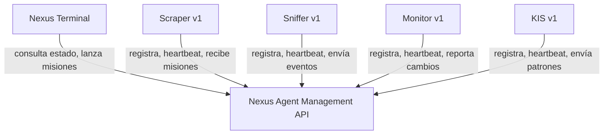

<div align="center">
  <h1 style="font-family: monospace; color: #c9d1d9;">Hi, I am <span style="color: #58a6ff;">Alone</span></h1>
</div>


### Alone | Solucionador Técnico
Desarrollador especializado en automatización de procesos, extracción de datos y configuración de servidores.

**Stack principal:**
- Python (Scripting, Scraping, Automatización)
- WordPress (Optimización, Migración, Seguridad)
- Linux (Bash, Administración de Servidores)
- conocimiento en ciberseguridad | hacking ético 

<br clear="right">

---

## Skills

### Languages & Frameworks


### Tools & Platforms


---

## Proyectos
- Scripts de automatización para tareas repetitivas
- Configuraciones de seguridad para sitios con alto tráfico
- Herramientas de análisis de datos desde fuentes públicas

---

## Connect with me

[](https://www.reddit.com/user/alonex_x1)
[](https://github.com/Alonex-x)
[](mailto:alonex_x.com@proton.me)

## GitHub Stats

<div align="center">
  
  <br>
  
</div>

---

```markdown
# Nexus Ecosystem

Sistema modular de agentes de software autónomos. Cada componente se comunica a través de una API REST central, permitiendo registro, asignación de misiones, reporte de eventos y supervisión en tiempo real.

## Cómo empezar

1. **Clonar los repositorios:**
   - [nexus-agent-api](https://github.com/Alonex-x/nexus-agent-api)
   - [nexus-scraper](https://github.com/Alonex-x/nexus-scraper)
   - [nexus-terminal](https://github.com/Alonex-x/nexus-terminal)

2. **Orden de arranque:**
   - **Primero:** levantar la API (puerto `8080`).
   - **Segundo:** ejecutar el scraper (se registra contra la API y consulta misiones cada 30s).
   - **Tercero:** abrir el panel de control (consulta el estado de los agentes en tiempo real).

3. **Registro y comunicación:**
   - Cada agente se registra con `POST /api/v1/agents/register` y obtiene una API Key.
   - Los agentes envían heartbeats periódicos (`POST /api/v1/agents/heartbeat`).
   - Las misiones se crean en la API y son recogidas por los agentes correspondientes.

## Arquitectura



## Componentes

| Proyecto | Lenguaje | Descripción |
|----------|----------|-------------|
| [Nexus Terminal](https://github.com/Alonex-x/nexus-terminal) | HTML/CSS/JS | Panel de control visual con estética CRT |
| [Nexus Agent Management API](https://github.com/Alonex-x/nexus-agent-api) | Java/Spring Boot | API REST central del ecosistema |
| [Nexus Scraper](https://github.com/Alonex-x/nexus-scraper) | Python/Playwright | Agente de web scraping sigiloso |
| [Desktop Automation Toolkit](https://github.com/Alonex-x/desktop-automation-toolkit) | Python | Automatización de tareas de escritorio |
| [Network Traffic Analyzer](https://github.com/Alonex-x/network-traffic-analyzer) | Java | Análisis de tráfico de red |
| [File Integrity Monitor](https://github.com/Alonex-x/file-integrity-monitor) | C++ | Monitor de integridad de archivos |
| [KIS](https://github.com/Alonex-x/nexus-kis) | C++ | Estadísticas de entrada de teclado |

## Demos

- **Nexus Terminal (demo en vivo):** [alonex-x.github.io/nexus-terminal](https://alonex-x.github.io/nexus-terminal)
- **Video del scraper en acción:** [Ver demo](https://raw.githubusercontent.com/Alonex-x/nexus-scraper/main/demos/demo-scraper.mp4)
```

---
